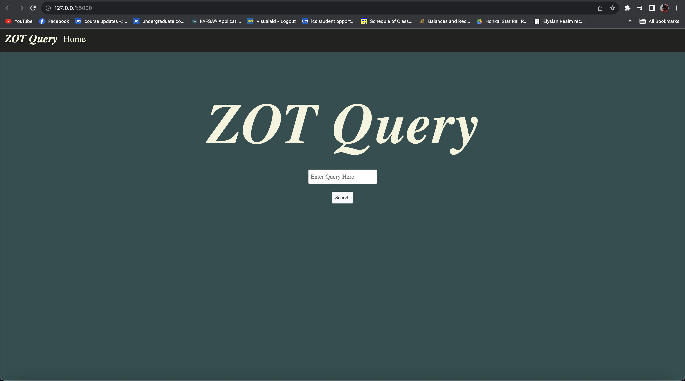
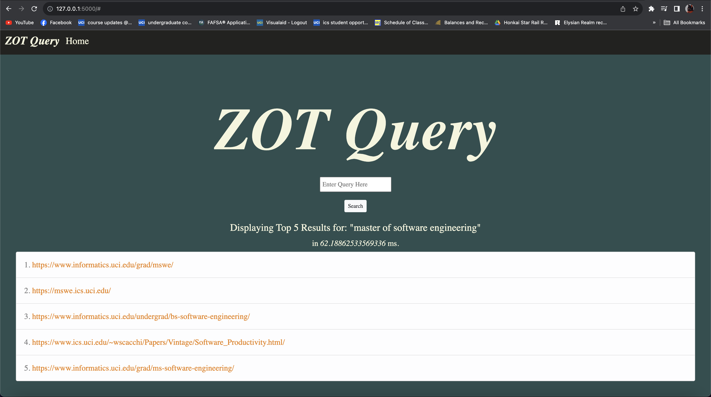
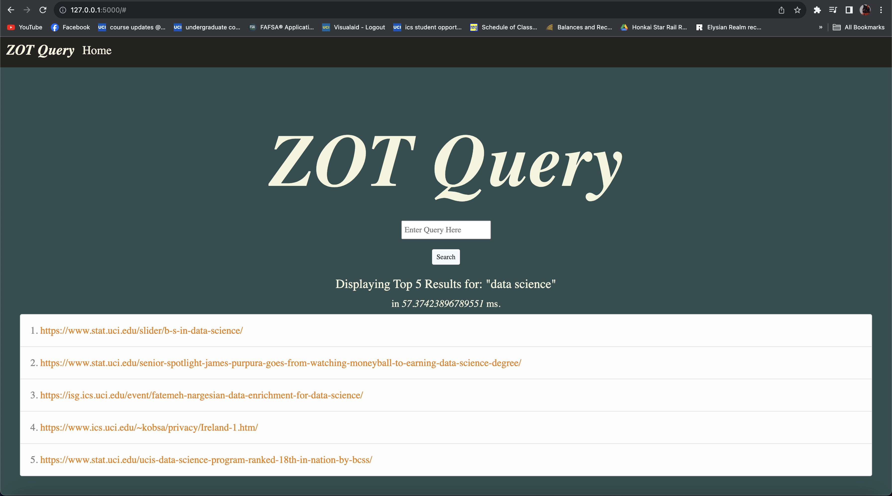
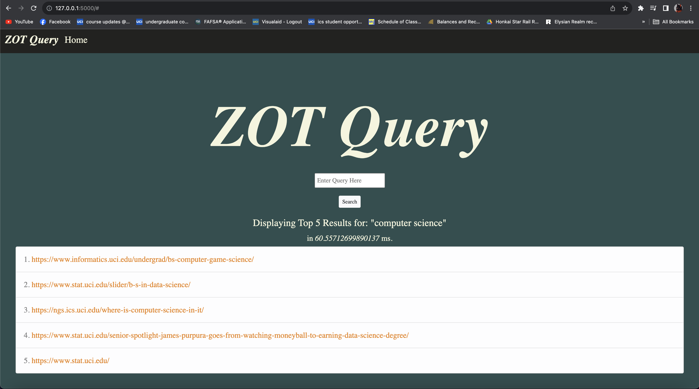

# ZOT Query 

## ABOUT

This is a search engine that uses rank retrieval to retrieve urls that are most relevant to the query based on the index that was built.

## CONFIGURATION

1. Installing libraries
   - There are some required libraries that must be installed that are not part of the standard Python libraries. These must be installed prior to running anything and can be done by running the command below.

     ```
     pip install -r requirements.txt
     ```

3. Documents
   - The documents that the index will be built from need to be placed in a folder named `DEV`
   - All the documents within in this folder should be JSON files


## EXECUTION

1. **Building the Index**
   - To build the index run the command below
     ```
     python index.py
     ```
   - As long as the documents have been placed in the appropriate folder and all required packages are installed, a folder called `indexes` and three files will be created in total
      - `doc_url_dev.json`
        - This is the dictionary that contains the document id to document url key pairs
      - `indexes/final_index.json`
         - This is the built index
      - `indexes/index_of_index.json`
         - This is an index of the built index for optimization purposes so the entire index will not be needed to load into memory     
   - *Note: This process takes a while to run, but there should be print statements that provides progress updates throughout the build. For reference, building the index for 55K+ documents took around an hour.*

3. **Starting up the Search Interface**
   - To start up the search interface, run the command below
     ```
     python run_server.py
     ```
   - This will start up the server and automatically open a new window to display the search interface via a web browser
   - *Note: If a new window does not open with the app, go to `http://127.0.0.1:5000` on any web browser to access it.*
   - Displayed below is an image of the search interface

      
      
5. **Performing a Query**
   - To perform any query, enter any query in the input prompt and press either the enter key or the search button
   - If a result is found within the index, the top 5 urls will be displayed if possible in a list format under the input prompt along with the amount of time in ms it took to retrieve that information for that particular query
   - These urls are clickable and can be used to redirect to the actual web page
   - Below are some examples of searched queries

      
      
      
      
      
      
      
      
7. **Additional Notes**
    - If an error pops up, such as accessed denied, you may need to wait a bit for everything to successfully render/load and it should work in a few minutes
    - Make sure the url has `http://` instead of `https://`

## VIDEO WALKTHROUGH


